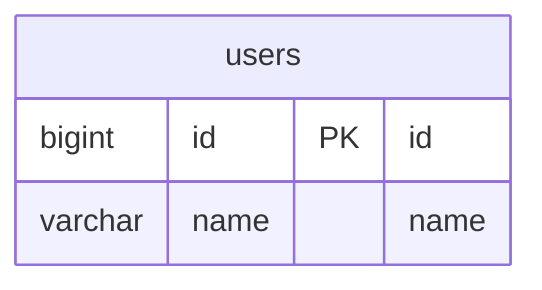

# go-redis-sample

go-redis を使用したサンプル

## command

```
make up

docker compose exec -it db chmod 700 /script/init.sh
docker compose exec -it db /script/init.sh
```

## db



## reference

- [go-redis](https://github.com/redis/go-redis)
