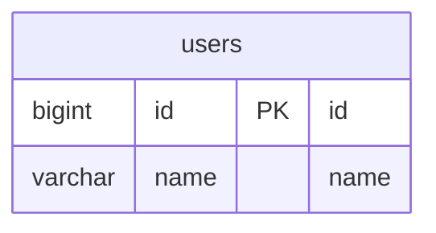

# go-redis-sample

go-redis を使用したサンプル

## command

```
make up

docker compose exec -it db chmod 700 /script/init.sh
docker compose exec -it db /script/init.sh
```

## db



## reference

- [go-redis](https://github.com/redis/go-redis)
- [Go のキャッシュ実装をジェネリクスで共通化する](https://tech.anti-pattern.co.jp/go-cache-gen/)
- [Go で多層キャッシュを実装するときに役立つ tips](https://tech.gunosy.io/entry/go-multi-layered-cache-tips#f-9022270a)
